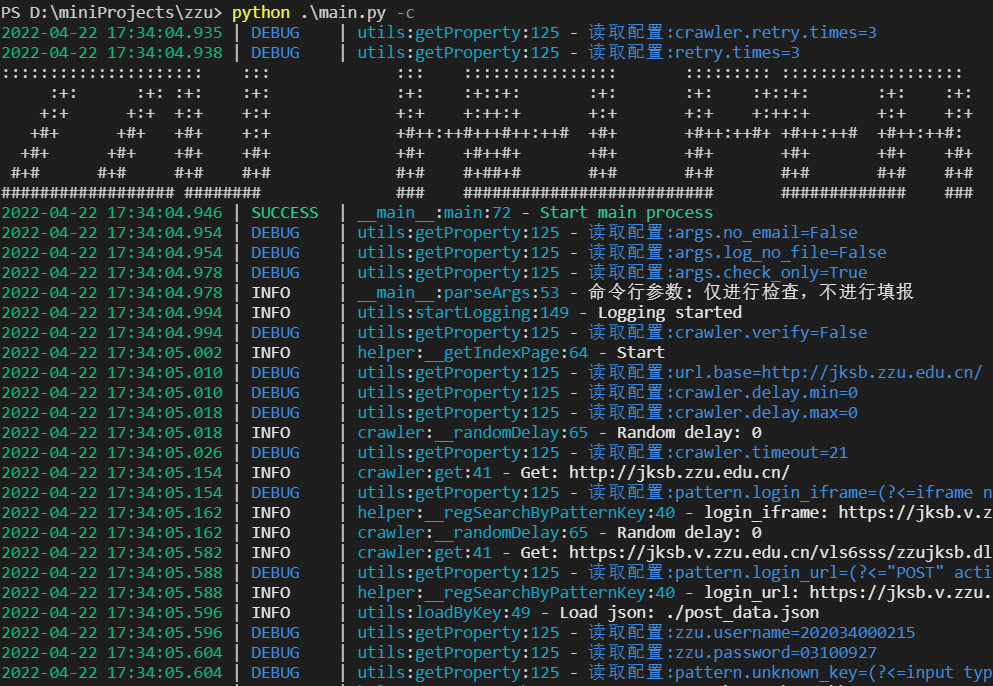
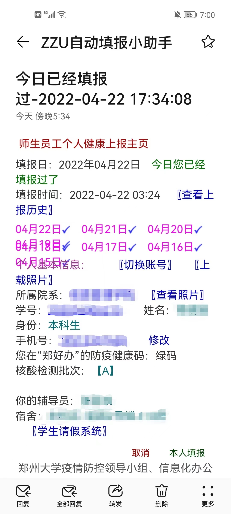

# zzu-helper    

<p align="center">
  
</p>

- 为了更好地建设祖国，我们必须节约时间！

- 本产品旨在充分利用时间，将打卡所花时间更好地用于学习和工作当中.

- 如果你出现相关症状，请立即如实向上级汇报.

- 如果您认为该项目涉及侵权等一系列问题，我可以随时删库跑路.

<p float="left">
  
  
</p>

## ✨特性

- 📧**邮件告警**  发生预料之外的错误时发送邮件通知

- 💪**高稳定性**  遇到错误时将自动重试

- 😊**自由定制** 大量可配置内容

- 👻**伪装请求** 可配置停顿时间和浏览器请求头

- 📜**详尽日志**  完整日志和详细调用堆栈

- 🖥️☁️📱**多种部署方式**  手机、个人电脑、服务器、腾讯云函数均有详细部署文档

## 🎬快速开始

1. 克隆仓库

    ```bash
    git clone https://github.com/yaaprogrammer/zzu-helper.git
    ```

2. 安装依赖

    ```bash
    pip install -r requirements.txt
    ```

3. 添加定时任务

    ```bash
    crontab -e
    ```

    ```cronie
    20 4 * * * /usr/bin/python3 /root/zzu-helper/main.py
    ```

## 🔤命令行参数

```help
usage: main.py [-h] [-n] [-l] [-c]

ZZU疫情填报小助手

optional arguments:
  -h, --help         show this help message and exit
  -n, --no-email     不发送邮件
  -l, --log-no-file  不输出日志到文件
  -c, --check-only   仅进行检查，不进行填报
```

## 📘详细文档

- ⚙️[配置文件详解](./doc/config.md)
- 📧[邮件服务配置](./doc/mail-settings.md)
- 📊[POST请求数据](./doc/data.md)
- 🪟[Windows个人电脑部署](./doc/windows-deployment.md)
- 🖥️[腾讯云服务器部署](./doc/tencent-server-deployment.md)
- 📱[安卓手机部署](./doc/android-deployment.md)
- ☁️[腾讯云函数部署](./doc/tencent-cloud-function-depolyment.md)

## 💬已知问题

- 没有对登录结果验证，登录失败没有提示，会在后续代码中引发异常，请配置好正确的学号密码
- 短时间多次登录会出现验证码，导致登录失败，之后的版本会增加自动填写验证码功能

## 📝许可

[MIT](./LICENSE) 开源许可证

## 🧍贡献

欢迎提Issue或提交PR!
