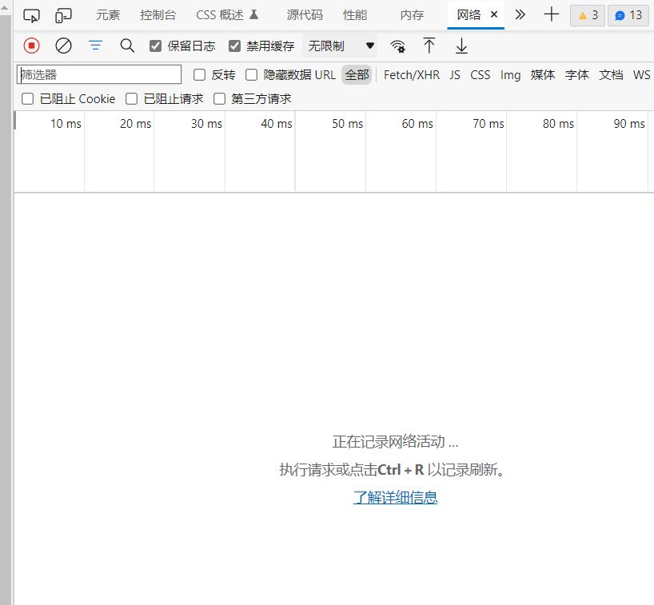

# POST请求数据

`post_data.json`文件中记录了一些POST请求中不变的数据，请根据具体情况修改。(默认配置可以正常填报，但是省份地区经纬度等信息不准确，需要更改)

## 登录POST数据

```json
"login": {
        "smbtn": "进入健康状况上报平台"
    }
```

该数据无需修改

## 填报入口POST数据

```json
"entry": {
        "did": "1",
        "door": "",
        "men6": "a"
    }
```

该数据无需修改

## 填报提交POST数据

```json
"submit": {
        "myvs_1": "否",
        "myvs_2": "否",
        "myvs_3": "否",
        "myvs_4": "否",
        "myvs_5": "否",
        "myvs_6": "否",
        "myvs_7": "否",
        "myvs_8": "否",
        "myvs_9": "否",
        "myvs_10": "否",
        "myvs_11": "否",
        "myvs_12": "否",
        "myvs_13a": "14",
        "myvs_13b": "1408",
        "myvs_13c": "郑州大学",
        "myvs_24": "否",
        "myvs_26": "5",
        "memo22": "成功获取",
        "did": "2",
        "door": "",
        "day6": "",
        "men6": "a",
        "sheng6": "",
        "shi6": "",
        "fun3": "",
        "jingdu": "111.013389",
        "weidu": "35.032707"
    }
```

请根据如下步骤修改默认值:

1. 登录并进入填报表单，根据实际情况填写完成，**先不要提交**

2. 按F12打开开发者工具，切换到`网络`一栏

    

3. 点击确认提交填报信息，找到请求URL为`https://jksb.v.zzu.edu.cn/vls6sss/zzujksb.dll/jksb`的项，切换到`负载`。对比并修改`post_data.json`中的数据。
