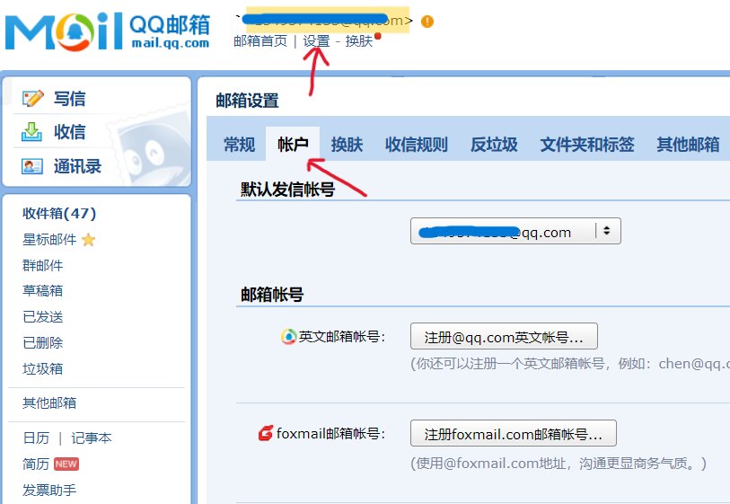
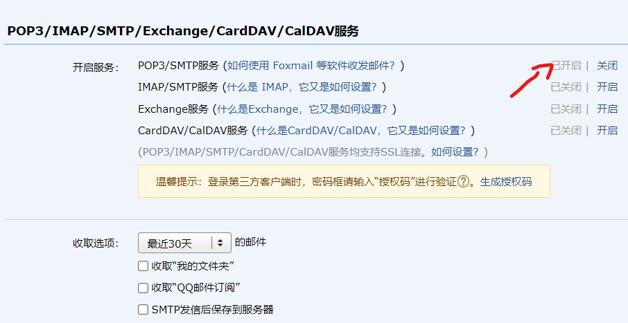
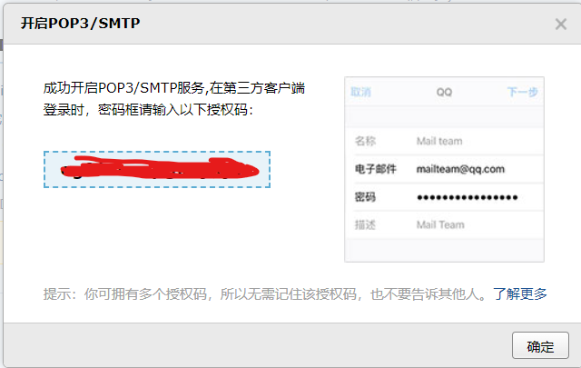

# 邮件服务配置

本配置以QQ邮箱为例，其他邮箱类似

1. 登录并打开QQ邮箱账户设置

    

2. 开启POP3/SMTP服务

    

    此时会要求你验证密保手机，按步骤完成即可.

3. 复制授权码

    

4. 编辑配置文件

    ```bash
    vim config_custom.yml
    ```

    ```yaml
    smtp:
        enable: true
        host: smtp.qq.com
        user: xxxxx@qq.com #你的QQ邮箱
        password: xxxxx # 这里填授权码
        port: 465
        ssl: true
        message:
            from: ZZU自动填报小助手
            to: xxx # 填写一个昵称即可，不重要
            receivers:
            - xxxxx@qq.com # 填写你自己的邮箱地址就可以，有多个收件人可以再加
            # - xxxxxx@qq.com
    ```
