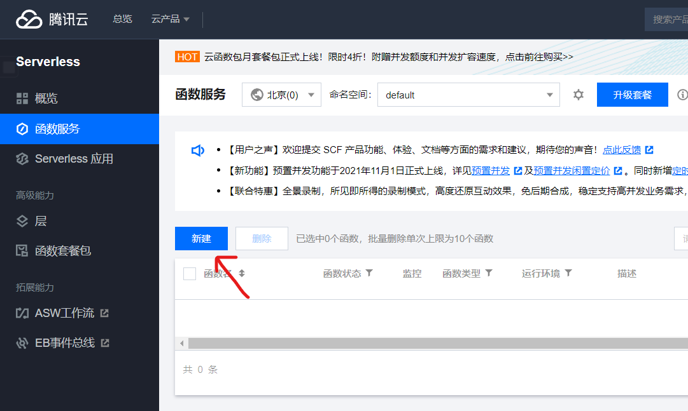
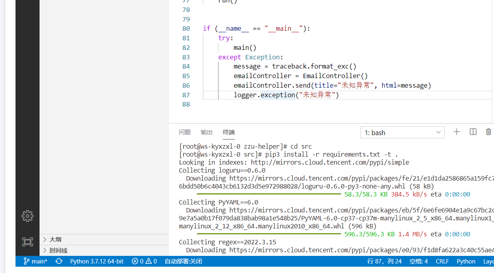

# 腾讯云函数部署

1. 登录腾讯云控制台

2. 进入`云函数`管理面板

3. 新建函数服务
   

4. 运行环境为`Python 3.7`
   

5. 执行方法为`main.main`, 上传项目文件夹
   

6. 创建触发器
   [学习crontab语法](https://www.runoob.com/linux/linux-comm-crontab.html)  
   

7. 在`config.yml`同级目录下创建目录`config_custom.yml`

   ```yaml
   smtp:
      enable: false
   zzu:
      username: xxxxxxx # 你的学号
      password: xxxxxxx # 你的密码
   
   logger:
      enable: false # 关闭日志记录
   ```

8. 为项目安装依赖

   ```bash
   cd src
   pip3 install -r requirements.txt -t . 
   ```

   

   点击`部署`后再进行`测试`
