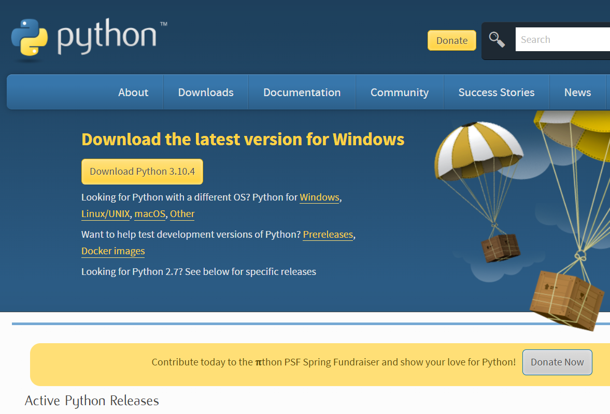

# Windows个人电脑部署

优势:

- 没有开销
- 部署简单

缺点:

- 仍然需要手动运行，除非你可以一直开着电脑

## 安装Python



[python.org](https://www.python.org/downloads/) 下载最新版本即可

安装时记得勾选`添加到环境变量PATH`.  
没有勾选也没关系, 可以查一下怎么添加。

## 安装Git


[git-scm.com](https://git-scm.com/downloads) 下载最新版本即可

安装时全部选择默认就可以了，一直Next

## 克隆仓库

安装好`Git`后，右键菜单里应该添加了一个`Git Bash here`, 在合适的文件夹里点击。

黑框框出现后，输入命令并回车

```bash
git clone https://github.com/yaaprogrammer/zzu-helper.git
```

## 安装依赖

在项目文件夹里打开`cmd`或`powershell`等命令行工具，输入

```bash
pip install -r requirements.txt
```

## 配置文件

打开`config.yml`

1. [邮件服务配置](./mail-settings.md)
2. 更改`zzu.username` `zzu.password`为你自己的学号和密码

## 测试

在项目文件夹里打开`cmd`或`powershell`等命令行工具，输入`python main.py`, 测试程序是否正常工作

## 启动脚本(可选)

创建一个`zzu-helper.txt`,写入启动命令

```bash
python D:/path/to/main.py
```

修改该文件扩展名为`.bat`

这样就可以双击开始填报啦。
